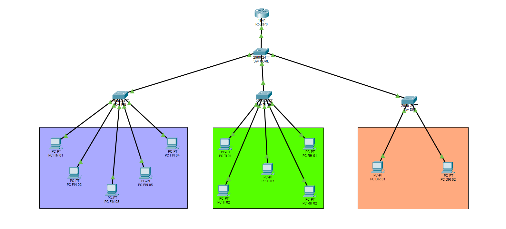
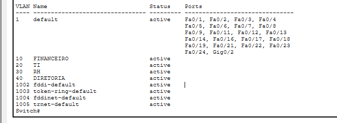
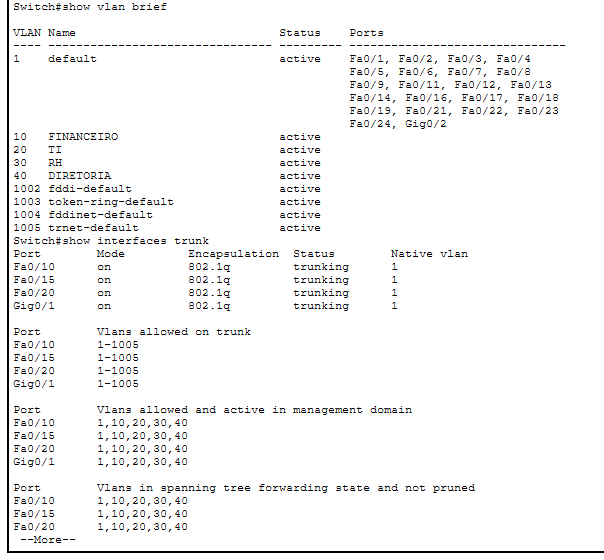
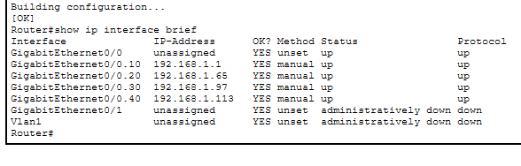
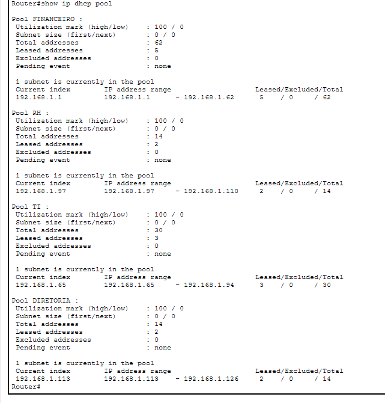
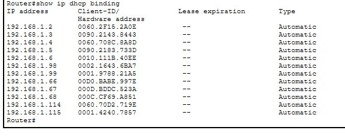
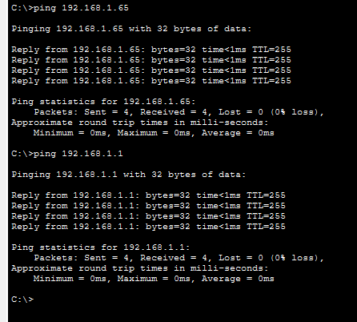

# 🖥️ TechStart Network Lab

## 📌 Sobre o projeto

Projeto de infraestrutura de rede corporativa desenvolvido utilizando o **Cisco Packet Tracer**.

O cenário representa a empresa fictícia **TechStart**, que precisava melhorar sua organização de rede através da separação dos departamentos, controle de endereçamento IP e comunicação eficiente entre os dispositivos.

Durante o laboratório foram aplicados conceitos fundamentais de redes, como **VLANs, Trunk, VLSM, Router-on-a-Stick e DHCP**.

---

# 🎯 Objetivos do projeto

- Separar departamentos utilizando VLANs.
- Melhorar a organização da rede através de subnetting.
- Permitir comunicação entre diferentes VLANs.
- Automatizar a configuração dos computadores utilizando DHCP.
- Validar o funcionamento através de testes de conectividade.

---

# 🛠️ Ferramenta utilizada

- Cisco Packet Tracer

---

# 🌐 Conceitos aplicados

## VLAN (Virtual Local Area Network)

VLANs permitem dividir uma rede física em redes lógicas independentes.

Neste projeto, cada departamento recebeu uma VLAN própria, reduzindo o tráfego de broadcast e melhorando a organização da infraestrutura.

Exemplo:

- VLAN 10 → Financeiro
- VLAN 20 → TI
- VLAN 30 → RH
- VLAN 40 → Diretoria

---

## Trunk (802.1Q)

O Trunk é utilizado para transportar várias VLANs através de um único link entre equipamentos de rede.

Neste projeto, os links Trunk foram configurados entre os switches e o roteador para permitir que todas as VLANs fossem transmitidas pela infraestrutura.

---

## VLSM (Variable Length Subnet Mask)

O VLSM permite dividir uma rede IP em sub-redes de tamanhos diferentes, aproveitando melhor os endereços disponíveis.

A rede inicial utilizada foi:

```
192.168.1.0/24
```

Ela foi dividida conforme a quantidade de dispositivos de cada departamento.

---

## Router-on-a-Stick

O Router-on-a-Stick permite que um único roteador faça o roteamento entre várias VLANs utilizando subinterfaces.

Cada subinterface representa o gateway de uma VLAN.

Exemplo:

```
VLAN 10 → 192.168.1.1
VLAN 20 → 192.168.1.65
VLAN 30 → 192.168.1.97
VLAN 40 → 192.168.1.113
```

---

## DHCP (Dynamic Host Configuration Protocol)

O DHCP permite que os computadores recebam automaticamente:

- Endereço IP.
- Máscara de rede.
- Gateway.
- Configurações necessárias para comunicação.

Neste projeto, o próprio roteador foi configurado como servidor DHCP.

---

# 🏢 Estrutura da rede

| VLAN | Departamento | Quantidade de hosts |
|---|---|---|
| VLAN 10 | Financeiro | 50 |
| VLAN 20 | TI | 20 |
| VLAN 30 | RH | 10 |
| VLAN 40 | Diretoria | 5 |

---

# 📡 Topologia da rede



---

# 🌐 Planejamento IP (VLSM)

| VLAN | Rede | Máscara | Gateway |
|---|---|---|---|
| VLAN 10 | 192.168.1.0/26 | 255.255.255.192 | 192.168.1.1 |
| VLAN 20 | 192.168.1.64/27 | 255.255.255.224 | 192.168.1.65 |
| VLAN 30 | 192.168.1.96/28 | 255.255.255.240 | 192.168.1.97 |
| VLAN 40 | 192.168.1.112/28 | 255.255.255.240 | 192.168.1.113 |

---

# ⚙️ Configurações realizadas

## 1. Criação das VLANs

As VLANs foram criadas nos switches para separar os departamentos.

Comandos utilizados:

```bash
enable
configure terminal

vlan 10
name FINANCEIRO

vlan 20
name TI

vlan 30
name RH

vlan 40
name DIRETORIA

end
```

Verificação:

```bash
show vlan brief
```

Resultado:



---

# 2. Configuração dos links Trunk

Os links Trunk permitem o transporte das VLANs entre os equipamentos.

Comando utilizado:

```bash
interface fastEthernet 0/10

switchport mode trunk
```

Verificação:

```bash
show interfaces trunk
```

Resultado:



---

# 3. Configuração do Router-on-a-Stick

Foram criadas subinterfaces no roteador para cada VLAN.

Exemplo:

```bash
interface gigabitEthernet 0/0.10

encapsulation dot1Q 10

ip address 192.168.1.1 255.255.255.192
```

Outras VLANs:

```bash
interface gigabitEthernet 0/0.20
encapsulation dot1Q 20
ip address 192.168.1.65 255.255.255.224


interface gigabitEthernet 0/0.30
encapsulation dot1Q 30
ip address 192.168.1.97 255.255.255.240


interface gigabitEthernet 0/0.40
encapsulation dot1Q 40
ip address 192.168.1.113 255.255.255.240
```

Verificação:

```bash
show ip interface brief
```

Resultado:



---

# 4. Configuração DHCP

Criação dos pools DHCP para cada VLAN.

Exemplo:

```bash
ip dhcp pool FINANCEIRO

network 192.168.1.0 255.255.255.192

default-router 192.168.1.1
```

Verificação dos pools:

```bash
show ip dhcp pool
```



Verificação dos IPs distribuídos:

```bash
show ip dhcp binding
```



---

# 🧪 Testes de conectividade

Foram realizados testes utilizando o comando:

```bash
ping
```

Exemplo:

```bash
ping 192.168.1.65
```

Teste entre VLANs:

```bash
ping 192.168.1.1
```

Resultado:



---

# 📚 Conhecimentos desenvolvidos

Durante o projeto foram praticados:

- Configuração de switches Cisco.
- Criação e gerenciamento de VLANs.
- Configuração de links Trunk.
- Planejamento de endereçamento IPv4.
- Subnetting utilizando VLSM.
- Comunicação entre redes utilizando roteamento.
- Configuração de DHCP.
- Testes e troubleshooting de conectividade.

---

# ✅ Status do projeto

Concluído.
